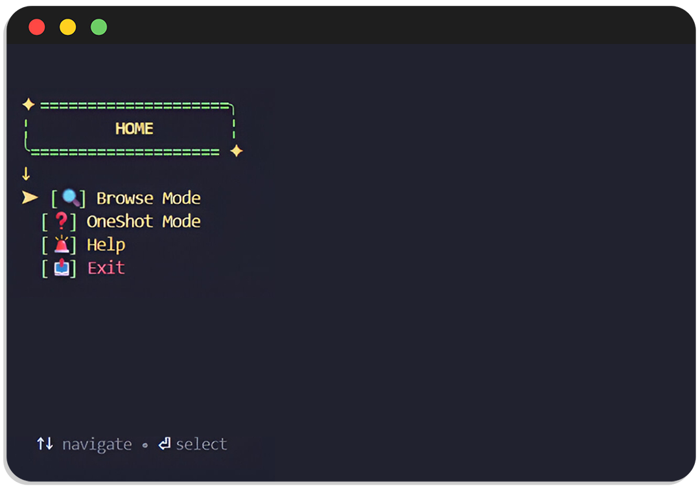

<p align="center">
  <br>
  <picture>
    <source media="(prefers-color-scheme: dark)" srcset="./github_assets/nizam-light.svg">
    <source media="(prefers-color-scheme: light)" srcset="./github_assets/nizam-dark.svg">
    
  </picture>
  <br>
    <h3 align="center">Smart setup for a ready to code Frontend project.</h3>
</p>
<br/>
<p align="center">
  
  
  
</p>
<br/>
<br/>

## What Is nizam ?

nizam is a CLI tool designed to quickly and efficiently scaffold Frontend projects by generating a clean, well structured, and production ready project setup.
In addition to creating an organized file structure, nizam allows developers to install any libraries of their choice and automatically apply their required configuration files, making them ready for immediate use without manual setup.

---

> nizam standardizes project initialization and improves developer productivity from day one.

- 📦 Install selected libraries seamlessly
- 🔩 Apply library specific configurations out of the box
- 🪄 Reduce repetitive manual setup
- 💡 Automatically create essential project files
- ⚡️ Speed up project initialization and focus on core development
- 🛠️ Generate a scalable and well organized Frontend project structure
- 📄 After completing the build, you will find a `NIZAM_DOC.md` file containing instructions and docs link for libraries you selected.

## All of this in one place

`React + vite`

`javaScript` ● `TypeScript`

`Bootstrap` ● `Tailwindcss` ● `Bulma` ● `Foundation` ● `Materialize`

`Material UI` ● `Ant Design` ● `Headless UI`

`React Router` ● `TanStack Router` ● `Wouter`

`Classic Router` ● `Data Router`

`React Context API` ● `Redux Toolkit` ● `Zustand`

`React Icons` ● `Lucide React` ● `Lord Icon` ● `Material Icons`

`React Helmet Async` ● `Dr. Pogodin React Helmet` ● `Unhead`

`Axios` ● `TanStack Query` ● `SWR`

###### _and more coming in next version_

## Explanation nizam ui

<p align="center">
  <picture>
    
  </picture>
</p>

### 🔍 Browse Mode

- multiple options with the ability to search or browse through comprehensive lists. Useful if you know which tools you'll be using.

### ❓ OneShot Mode

- a series of questions that suggest suitable options when you are unsure which tools to use.

### 🚨 Help

- it provides you with support and guidance, with an explanation of each question and the options that will be displayed, to make it easier to understand and use the tool.

## Get started with nizam

##### using npx:

```bash
npx create-nizam-app
```

<details>
 <summary>using npm</summary>
<br/>

```bash
npm i -g create-nizam-app
```

```bash
create-nizam-app
```

</details>

<details>
 <summary>using bun</summary>
<br/>

```bash
bun install -g create-nizam-app
```

```bash
bun run create-nizam-app
```

</details>

<details>
 <summary>using yarn</summary>
<br/>

```bash
yarn global add create-nizam-app
```

```bash
yarn create-nizam-app
```

</details>

<details>
 <summary>using pnpm</summary>
<br/>

```bash
pnpm add -g create-nizam-app
```

```bash
pnpm create-nizam-app
```

</details>

## Project License

Copyright (c) Ahmed Abd Alalim. All rights reserved.

This program has been licensed under the [MIT](LICENSE) License. If you are a true FOSS (Free And Open Source Software) Lover, you wont customize this and redistribute this under your name

---

_We hope you find nizam to be a valuable tool in your software development journey. If you have any questions, feedback, or suggestions, please don't hesitate to reach out. Happy bake with nizam._
